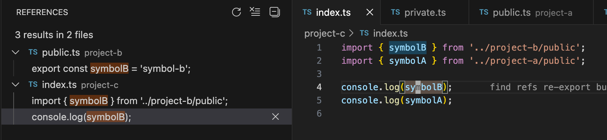
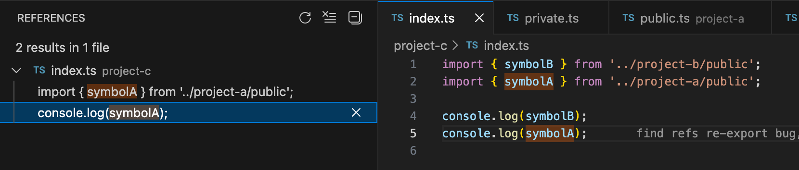

Used for sharing bug repros with TSGO team

## Find refs re-export bug

Find refs doesn't seem to be able to follow re-exports.

working example (no re-export):

bug example (symbol re-exported in barrel file):

